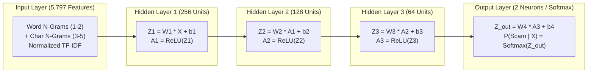

# BobSec Multilayer Perceptron (MLP) Architecture Specification

This document details the mathematical formulation, layer topology, forward propagation, loss optimization, and hyperparameters for the BobSec deep neural network subsystem.

---

## 1. Network Topology Overview

The BobSec neural network subsystem is a feedforward deep **Multilayer Perceptron (MLP)** designed to detect financial scams, social engineering vectors, and extortion attempts tailored specifically to Indian cybercrime patterns.

The network receives high-dimensional TF-IDF feature representations ($D_{in} = 5,797$ dimensions) combining character n-grams ($3 \le n \le 5$) and word n-grams ($1 \le n \le 2$) and maps them through three non-linear hidden representations into a calibrated posterior scam probability.

---

## 2. Layer Dimensionality and Parameter Count

| Layer | Type | Input Dim | Output Dim | Weights Matrix | Bias Vector | Activation |
| :--- | :--- | :--- | :--- | :--- | :--- | :--- |
| **Input ($a^{[0]}$)** | Feature Vector | 5,797 | 5,797 | — | — | NFKC Normalization |
| **Hidden Layer 1 ($a^{[1]}$)** | Fully Connected | 5,797 | 256 | $W^{[1]} \in \mathbb{R}^{5797 \times 256}$ | $b^{[1]} \in \mathbb{R}^{256}$ | $\text{ReLU}$ |
| **Hidden Layer 2 ($a^{[2]}$)** | Fully Connected | 256 | 128 | $W^{[2]} \in \mathbb{R}^{256 \times 128}$ | $b^{[2]} \in \mathbb{R}^{128}$ | $\text{ReLU}$ |
| **Hidden Layer 3 ($a^{[3]}$)** | Fully Connected | 128 | 64 | $W^{[3]} \in \mathbb{R}^{128 \times 64}$ | $b^{[3]} \in \mathbb{R}^{64}$ | $\text{ReLU}$ |
| **Output Layer ($a^{[4]}$)** | Classification Head | 64 | 2 | $W^{[4]} \in \mathbb{R}^{64 \times 2}$ | $b^{[4]} \in \mathbb{R}^{2}$ | $\text{Softmax}$ |

### Total Trainable Parameters:
$$\text{Parameters} = (5,797 \times 256 + 256) + (256 \times 128 + 128) + (128 \times 64 + 64) + (64 \times 2 + 2) = 1,525,442$$

---

## 3. Mathematical Formulation

### 3.1 Forward Propagation Equations

For an input instance $x \in \mathbb{R}^{D_{in}}$ where $a^{[0]} = x$:

1. **Hidden Layer 1:**
   $$z^{[1]} = W^{[1]T} a^{[0]} + b^{[1]}$$
   $$a^{[1]} = \text{ReLU}(z^{[1]}) = \max(0, z^{[1]})$$

2. **Hidden Layer 2:**
   $$z^{[2]} = W^{[2]T} a^{[1]} + b^{[2]}$$
   $$a^{[2]} = \text{ReLU}(z^{[2]}) = \max(0, z^{[2]})$$

3. **Hidden Layer 3:**
   $$z^{[3]} = W^{[3]T} a^{[2]} + b^{[3]}$$
   $$a^{[3]} = \text{ReLU}(z^{[3]}) = \max(0, z^{[3]})$$

4. **Output Layer:**
   $$z^{[4]} = W^{[4]T} a^{[3]} + b^{[4]}$$
   $$P(y = k \mid x) = \frac{\exp(z_k^{[4]})}{\sum_{j=1}^K \exp(z_j^{[4]})}, \quad k \in \{0, 1\}$$

where $k = 0$ corresponds to **Benign** communications and $k = 1$ corresponds to **Scam** threats.

---

### 3.2 Loss Function: Regularized Binary Cross-Entropy

The objective function minimizes the Cross-Entropy loss over $N$ training samples with $L_2$ weight regularization (weight decay $\alpha = 10^{-4}$):

$$\mathcal{J}(W, b) = -\frac{1}{N} \sum_{i=1}^{N} \left[ y^{(i)} \log \hat{y}^{(i)} + (1 - y^{(i)}) \log (1 - \hat{y}^{(i)}) \right] + \frac{\alpha}{2N} \sum_{l=1}^{L} \|W^{[l]}\|_F^2$$

where $\|W^{[l]}\|_F^2 = \sum_{j} \sum_{k} (W_{jk}^{[l]})^2$ denotes the squared Frobenius norm.

---

### 3.3 Adam Optimizer Dynamics

Weight updates are driven by the Adaptive Moment Estimation (Adam) optimizer:

$$\begin{aligned}
g_t &= \nabla_\theta \mathcal{J}(\theta_t) \\
m_t &= \beta_1 m_{t-1} + (1 - \beta_1) g_t \quad &&\text{(First Moment Estimate)} \\
v_t &= \beta_2 v_{t-1} + (1 - \beta_2) g_t^2 \quad &&\text{(Second Raw Moment Estimate)} \\
\hat{m}_t &= \frac{m_t}{1 - \beta_1^t} \quad &&\text{(Bias-Corrected First Moment)} \\
\hat{v}_t &= \frac{v_t}{1 - \beta_2^t} \quad &&\text{(Bias-Corrected Second Moment)} \\
\theta_{t+1} &= \theta_t - \frac{\eta}{\sqrt{\hat{v}_t} + \epsilon} \hat{m}_t \quad &&\text{(Parameter Update)}
\end{aligned}$$

Hyperparameters:
- Initial Learning Rate $\eta = 0.001$
- Decay Factors $\beta_1 = 0.9$, $\beta_2 = 0.999$
- Epsilon $\epsilon = 10^{-8}$
- Batch Size: Full batch gradient updates on training split ($N = 110$)
