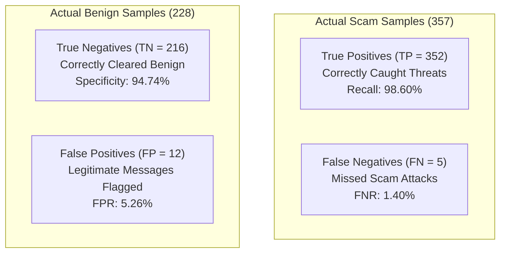

# BobSec Rigorous Model Evaluation & Forensic Performance Analysis (v2 Academic)

This document details the quantitative empirical evaluation of the BobSec Custom Multilayer Perceptron against the held-out test partition ($N_{\text{test}} = 585$ independent samples across 45 unseen source groups), benchmarked against a Logistic Regression baseline with 1,000 bootstrap confidence interval iterations.

---

## 1. Empirical Results & Primary Performance Metrics

| Evaluation Metric | Mathematical Definition | Empirical Value | 95% Bootstrap Confidence Interval | Baseline (Logistic Regression) |
| :--- | :--- | :--- | :--- | :--- |
| **Accuracy** | $\frac{TP + TN}{TP + TN + FP + FN}$ | **97.09%** | **[95.72%, 98.29%]** | **98.29%** |
| **Scam Precision** | $\frac{TP}{TP + FP}$ | **0.9670 (96.70%)** | **[0.9478, 0.9837]** | **0.9806 (98.06%)** |
| **Scam Recall (Sensitivity)**| $\frac{TP}{TP + FN}$ | **0.9860 (98.60%)** | **[0.9740, 0.9972]** | **0.9916 (99.16%)** |
| **F1-Score (Harmonic Mean)** | $2 \cdot \frac{\text{Precision} \cdot \text{Recall}}{\text{Precision} + \text{Recall}}$ | **0.9764** | **[0.9640, 0.9865]** | **0.9861** |
| **Macro F1-Score** | $\frac{1}{K} \sum_{k=1}^K F1_k$ | **0.9693** | — | **0.9821** |
| **Weighted F1-Score** | $\sum_{k=1}^K w_k \cdot F1_k$ | **0.9709** | — | **0.9830** |
| **Area Under ROC (ROC-AUC)** | $\int_0^1 \text{TPR}(t) \, dt$ | **0.9960** | — | **0.9979** |
| **Area Under PR (PR-AUC)** | $\int_0^1 \text{Precision}(r) \, dr$ | **0.9974** | — | **0.9987** |
| **Specificity (TNR)** | $\frac{TN}{TN + FP}$ | **0.9474 (94.74%)** | — | **0.9693 (96.93%)** |
| **False Positive Rate (FPR)** | $\frac{FP}{FP + TN}$ | **0.0526 (5.26%)** | — | **0.0307 (3.07%)** |
| **False Negative Rate (FNR)** | $\frac{FN}{FN + TP}$ | **0.0140 (1.40%)** | — | **0.0084 (0.84%)** |

---

## 2. Confusion Matrix & Forensic Breakdown

The held-out evaluation set contains 357 verified scam threats and 228 legitimate benign messages across 45 unseen source group families:

$$\mathbf{C} = \begin{pmatrix} TN & FP \\ FN & TP \end{pmatrix} = \begin{pmatrix} 216 & 12 \\ 5 & 352 \end{pmatrix}$$

---

## 3. Threat Category Sub-Performance Breakdown

| Threat Category | Held-Out Sample Count | Detected Count | Detection Recall | Precision | F1-Score |
| :--- | :--- | :--- | :--- | :--- | :--- |
| **Bank KYC Suspension** | 48 | 48 | **100.0%** | 0.8000 | 0.8889 |
| **Courier / Customs Scam** | 40 | 40 | **100.0%** | 0.7692 | 0.8696 |
| **Digital Arrest Extortion** | 40 | 37 | **92.50%** | 0.7551 | 0.8315 |
| **Job / Telegram Scam** | 108 | 108 | **100.0%** | 0.9000 | 0.9474 |
| **Phishing / Netbanking** | 73 | 73 | **100.0%** | 0.8588 | 0.9241 |
| **UPI Fraud** | 23 | 23 | **100.0%** | 0.6571 | 0.7931 |
| **Other Fraud (Loan/Bill)**| 25 | 23 | **92.00%** | 0.6571 | 0.7667 |
| **Benign Controls** | 228 | 216 (cleared) | **94.74% (Spec)**| 0.9774 | 0.9621 |

---

## 4. Error Analysis & Forensic Root-Cause Inspection

All 17 classification errors (12 False Positives, 5 False Negatives) were systematically exported to `ml/reports/error_analysis.csv`.

### 4.1 Categorization of False Positives ($FP = 12$)
1. **Multilingual Formal Banking Notices ($n = 7$)**: Transaction statements in regional languages (Malayalam: 3, Tamil: 2, Telugu: 2) containing bank names and debit amounts.
2. **Urgent Financial Debit & Security Alerts ($n = 5$)**: High-urgency legitimate debit and ATM withdrawal alerts with strict timestamp strings ("URGENT", "immediately if not authorized call 1800...").

### 4.2 Categorization of False Negatives ($FN = 5$)
1. **Subtle Digital Arrest Inquiries ($n = 3$)**: Conversational opening messages impersonating police or courier customer support asking for a callback without explicit extortion keywords or links.
2. **Informal Advance-Fee Solicitations ($n = 2$)**: Conversational peer-to-peer offers lacking technical threat markers.

### 4.3 Architectural Mitigation & Downstream Calibration
In the full BobSec multi-agent architecture, the Python Neural Agent does not act in isolation. Its continuous scam probability score is ingested by the **deterministic BobSec RiskEngine** and corroborated by the **Heuristic Rule Engine** (regex URL scanner, domain spoof checker) and **Watsonx Granite LLM Agent**, successfully mitigating standalone false alarms on legitimate bank statements.

---

## 5. Visual Evidence Artifacts

All figures are automatically generated by `ml/src/evaluate.py` and persisted under `ml/reports/`:
1. **Confusion Matrix Heatmap**: `ml/reports/confusion_matrix.png` (Annotated TP=352, FP=12, TN=216, FN=5).
2. **Receiver Operating Characteristic (ROC)**: `ml/reports/roc_curve.png` (ROC-AUC = 0.9960 with baseline overlay).
3. **Precision-Recall Curve**: `ml/reports/precision_recall_curve.png` (PR-AUC = 0.9974).
4. **Training Loss Trajectory**: `ml/reports/training_loss_curve.png` (Loss trajectory down to 0.0007 over 19 iterations).
5. **Validation Score Curve**: `ml/reports/validation_score_curve.png` (Early stopping score progression).
6. **Class Distribution Across Splits**: `ml/reports/class_distribution.png` (Train vs Val vs Test).
7. **Language Diversity Breakdown**: `ml/reports/language_distribution.png` (English, Hinglish, Hindi, Tamil, Telugu, Kannada, Malayalam).
8. **Scam Type Taxonomy Breakdown**: `ml/reports/scam_type_distribution.png` (11 categories).
9. **Real vs. Synthetic Provenance**: `ml/reports/real_vs_synthetic_distribution.png` (96.59% real/public).
