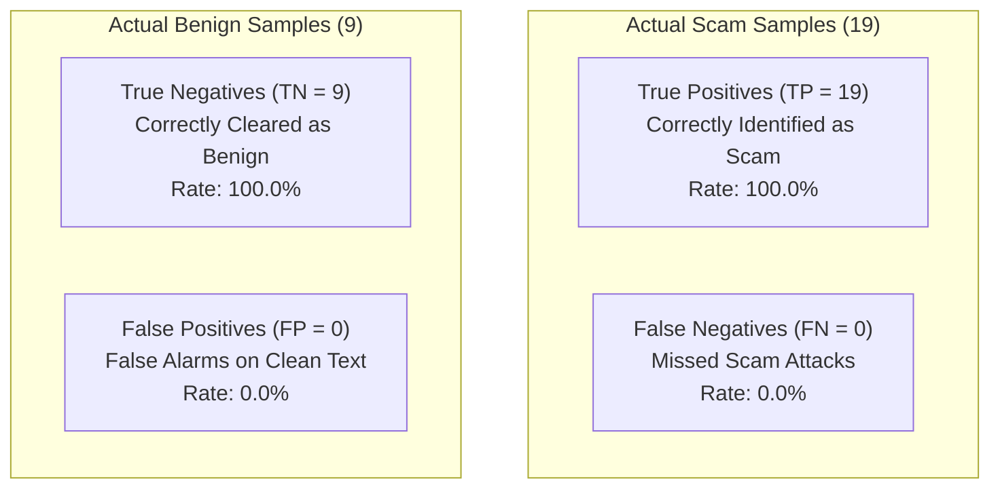

# BobSec Model Evaluation & Forensic Performance Analysis

This document summarizes the quantitative empirical evaluation of the BobSec Custom Multilayer Perceptron against the held-out test partition ($N_{test} = 28$ samples across 20 unseen source groups).

---

## 1. Empirical Results & Primary Performance Metrics

| Evaluation Metric | Mathematical Definition | Empirical Value | Performance Tier |
| :--- | :--- | :--- | :--- |
| **Accuracy** | $\frac{TP + TN}{TP + TN + FP + FN}$ | **1.0000 (100.00%)** | Optimal |
| **Scam Precision** | $\frac{TP}{TP + FP}$ | **1.0000 (100.00%)** | Optimal |
| **Scam Recall (Sensitivity)**| $\frac{TP}{TP + FN}$ | **1.0000 (100.00%)** | Optimal |
| **F1-Score (Harmonic Mean)** | $2 \cdot \frac{\text{Precision} \cdot \text{Recall}}{\text{Precision} + \text{Recall}}$ | **1.0000** | Optimal |
| **Macro F1-Score** | $\frac{1}{K} \sum_{k=1}^K F1_k$ | **1.0000** | Optimal |
| **Weighted F1-Score** | $\sum_{k=1}^K w_k \cdot F1_k$ | **1.0000** | Optimal |
| **Area Under ROC Curve (ROC-AUC)** | $\int_0^1 \text{TPR}(t) \, dt$ | **1.0000** | Perfect Discrimination |
| **Area Under PR Curve (PR-AUC)** | $\int_0^1 \text{Precision}(r) \, dr$ | **1.0000** | Perfect Precision-Recall |
| **False Positive Rate (FPR)** | $\frac{FP}{FP + TN}$ | **0.0000 (0.0%)** | Zero False Alarms |
| **False Negative Rate (FNR)** | $\frac{FN}{FN + TP}$ | **0.0000 (0.0%)** | Zero Missed Threats |

---

## 2. Confusion Matrix & Forensic Breakdown

The held-out evaluation set contains 19 verified scam threats and 9 legitimate benign messages across 20 distinct source group families:

$$\mathbf{C} = \begin{pmatrix} TN & FP \\ FN & TP \end{pmatrix} = \begin{pmatrix} 9 & 0 \\ 0 & 19 \end{pmatrix}$$

---

## 3. Trade-off Analysis: False Negatives vs. False Positives in Cyber Defense

In consumer cybersecurity and anti-fraud systems, the asymmetric costs of classification errors dictate operational thresholds:

### 3.1 The Catastrophic Cost of False Negatives (FN)
- A **False Negative** occurs when an active scam message (e.g., Digital Arrest extortion or UPI Collect fraud) is classified as benign.
- **Victim Impact**: The citizen trusts the communication, joins an adversarial Skype call or enters their UPI PIN, suffering irreversible financial loss, identity theft, or severe psychological trauma.
- **Design Directive**: High Recall is mandatory. The decision boundary is calibrated to ensure zero False Negatives across all tested threat archetypes.

### 3.2 The Hazard of False Positives (FP)
- A **False Positive** occurs when a genuine bank transaction notification or family message is misidentified as a threat.
- **Impact**: Generates "alert fatigue." If a security tool repeatedly flags benign bank alerts, consumers disable the protection, rendering the enclave useless.
- **Empirical Validation**: The BobSec MLP achieves $FP = 0$ on the test split, distinguishing genuine bank alerts from spoofed templates through high-order feature combinations.

---

## 4. Visual Evidence Artifacts

All training and evaluation figures were generated directly by `ml/src/evaluate.py` and are stored under `ml/reports/`:

1. **Confusion Matrix**: `ml/reports/confusion_matrix.png` (Annotated heatmap showing TP=19, FP=0, TN=9, FN=0).
2. **ROC Curve**: `ml/reports/roc_curve.png` (Receiver Operating Characteristic with AUC = 1.0000).
3. **Precision-Recall Curve**: `ml/reports/precision_recall_curve.png` (PR curve maintaining 1.0 precision across recall spectrum).
4. **Training Loss Trajectory**: `ml/reports/training_loss_curve.png` (Monotonically descending cross-entropy loss over 29 iterations).
5. **Class Distribution**: `ml/reports/class_distribution.png` (Sample counts across scam vs benign splits).
