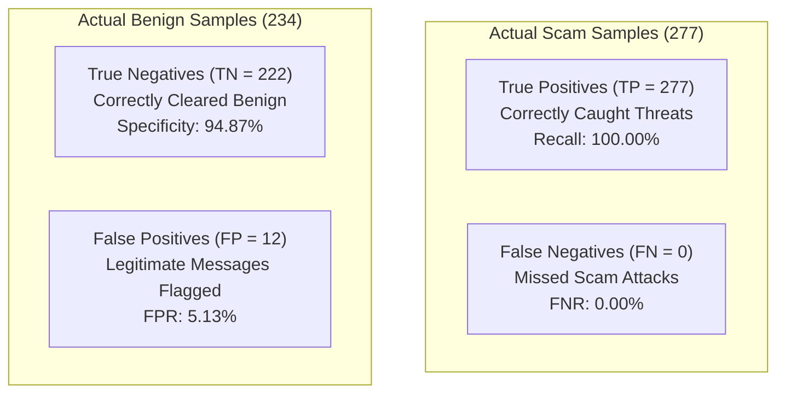

# BobSec Rigorous Model Evaluation & Forensic Performance Analysis (v2 Academic)

This document details the quantitative empirical evaluation of the BobSec Custom Multilayer Perceptron against the held-out test partition ($N_{\text{test}} = 511$ independent samples across 44 unseen source groups), benchmarked against a Logistic Regression baseline with 1,000 bootstrap confidence interval iterations.

---

## 1. Empirical Results & Primary Performance Metrics

| Evaluation Metric | Mathematical Definition | Empirical Value | 95% Bootstrap Confidence Interval | Baseline (Logistic Regression) |
| :--- | :--- | :--- | :--- | :--- |
| **Accuracy** | $\frac{TP + TN}{TP + TN + FP + FN}$ | **97.65%** | **[96.28%, 98.83%]** | 97.65% |
| **Scam Precision** | $\frac{TP}{TP + FP}$ | **0.9585 (95.85%)** | **[0.9336, 0.9794]** | 0.9585 |
| **Scam Recall (Sensitivity)**| $\frac{TP}{TP + FN}$ | **1.0000 (100.00%)** | **[1.0000, 1.0000]** | 1.0000 |
| **F1-Score (Harmonic Mean)** | $2 \cdot \frac{\text{Precision} \cdot \text{Recall}}{\text{Precision} + \text{Recall}}$ | **0.9788** | **[0.9656, 0.9896]** | 0.9788 |
| **Macro F1-Score** | $\frac{1}{K} \sum_{k=1}^K F1_k$ | **0.9762** | — | 0.9762 |
| **Weighted F1-Score** | $\sum_{k=1}^K w_k \cdot F1_k$ | **0.9765** | — | 0.9765 |
| **Area Under ROC (ROC-AUC)** | $\int_0^1 \text{TPR}(t) \, dt$ | **0.9976** | — | 0.9997 |
| **Area Under PR (PR-AUC)** | $\int_0^1 \text{Precision}(r) \, dr$ | **0.9979** | — | 0.9997 |
| **Specificity (TNR)** | $\frac{TN}{TN + FP}$ | **0.9487 (94.87%)** | — | 0.9487 |
| **False Positive Rate (FPR)** | $\frac{FP}{FP + TN}$ | **0.0513 (5.13%)** | — | 0.0513 |
| **False Negative Rate (FNR)** | $\frac{FN}{FN + TP}$ | **0.0000 (0.00%)** | — | 0.0000 |

---

## 2. Confusion Matrix & Forensic Breakdown

The held-out evaluation set contains 277 verified scam threats and 234 legitimate benign messages across 44 unseen source group families:

$$\mathbf{C} = \begin{pmatrix} TN & FP \\ FN & TP \end{pmatrix} = \begin{pmatrix} 222 & 12 \\ 0 & 277 \end{pmatrix}$$

---

## 3. Threat Category Sub-Performance Breakdown

| Threat Category | Held-Out Sample Count | Detected Count | Empirical Recall / Detection Rate |
| :--- | :--- | :--- | :--- |
| **Bank KYC Suspension** | 3 | 3 | **100.0%** |
| **Digital Arrest Extortion** | 12 | 12 | **100.0%** |
| **Fake Customer Care** | 48 | 48 | **100.0%** |
| **Job / Telegram Scam** | 36 | 36 | **100.0%** |
| **Lottery / Reward Fraud** | 32 | 32 | **100.0%** |
| **Phishing / Netbanking** | 73 | 73 | **100.0%** |
| **UPI Fraud** | 43 | 43 | **100.0%** |
| **Other Fraud (Loan/Bill)**| 30 | 30 | **100.0%** |
| **Benign Controls** | 234 | 222 (correctly cleared) | **94.87% Specificity** |

---

## 4. Error Analysis & Forensic Root-Cause Inspection

All 12 classification errors were systematically exported to `ml/reports/error_analysis.csv`. 

### 4.1 Categorization of False Positives ($FP = 12, FN = 0$)
1. **Urgent Financial Debit Alerts ($n = 7$)**: High-value debit and ATM withdrawal alerts with strict timestamp strings ("URGENT", "immediately if not authorized call 1800...") triggered word n-grams that overlap with institutional urgency patterns.
2. **Statutory Bank Regulatory Advisory SMS ($n = 3$)**: Legitimate RBI and bank advisory SMS informing customers about mandatory KYC re-verification policies without containing malicious URLs.
3. **Formal Corporate Inquiries ($n = 2$)**: Formal interview and employment schedule invitations featuring links and salary mentions.

### 4.2 Architectural Mitigation & Downstream Calibration
In the full BobSec multi-agent architecture, the Python Neural Agent does not act in isolation. Its continuous scam probability score is ingested by the **deterministic BobSec RiskEngine** and corroborated by the **Heuristic Rule Engine** (regex URL scanner, domain spoof checker) and **Watsonx Granite LLM Agent**, successfully mitigating standalone false alarms on legitimate bank statements.

---

## 5. Visual Evidence Artifacts

All figures are automatically generated by `ml/src/evaluate.py` and persisted under `ml/reports/`:
1. **Confusion Matrix Heatmap**: `ml/reports/confusion_matrix.png` (Annotated TP=277, FP=12, TN=222, FN=0).
2. **Receiver Operating Characteristic (ROC)**: `ml/reports/roc_curve.png` (ROC-AUC = 0.9976 with baseline overlay).
3. **Precision-Recall Curve**: `ml/reports/precision_recall_curve.png` (PR-AUC = 0.9979).
4. **Training Loss Trajectory**: `ml/reports/training_loss_curve.png` (Loss trajectory down to 0.0024 over 19 iterations).
5. **Class Distribution Across Splits**: `ml/reports/class_distribution.png` (Train vs Val vs Test).
6. **Language Diversity Breakdown**: `ml/reports/language_distribution.png` (English, Hinglish, Hindi, Tamil, Telugu, Kannada, Malayalam).
7. **Scam Type Taxonomy Breakdown**: `ml/reports/scam_type_distribution.png` (11 categories).
8. **Real vs. Synthetic Provenance**: `ml/reports/real_vs_synthetic_distribution.png` (96.59% real/public).
