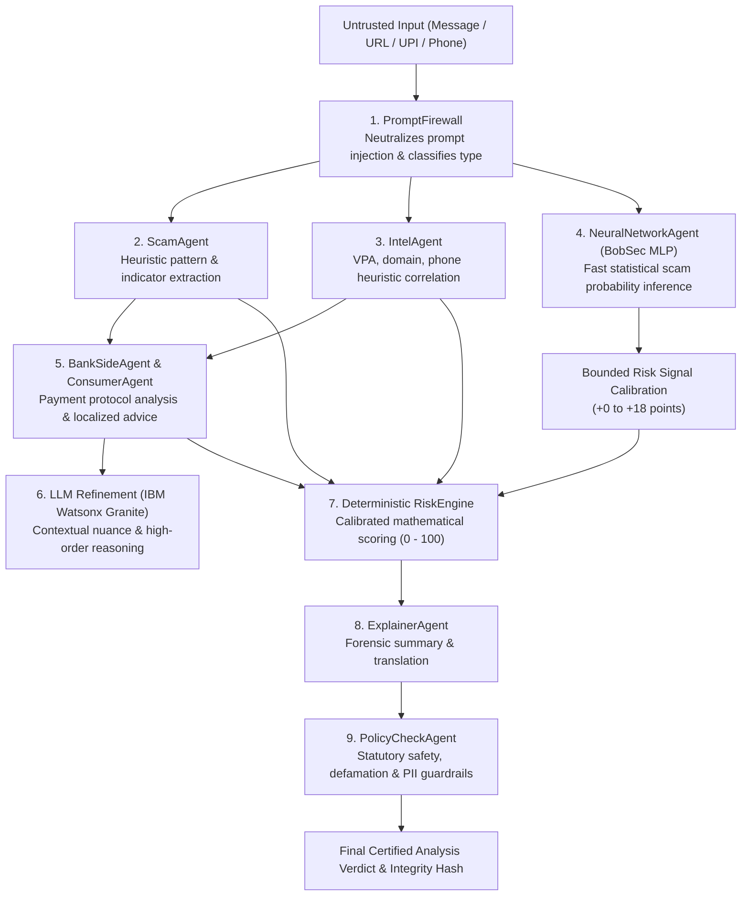
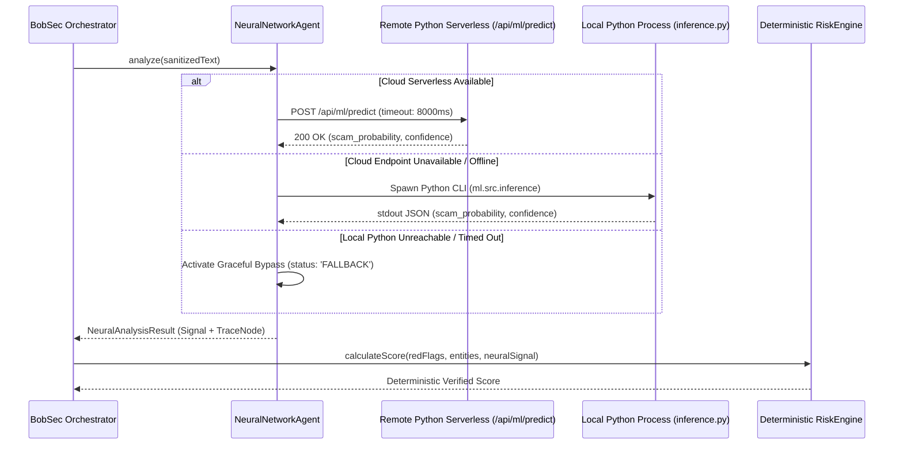

# BobSec Hybrid System Integration & Fail-Safe Architecture

This document describes the multi-agent synthesis connecting the Custom Multilayer Perceptron (MLP) neural network, LLM contextual reasoning (IBM Watsonx Granite), and the sovereign deterministic RiskEngine.

---

## 1. Tripartite Defense Paradigm

BobSec implements a defense-in-depth architecture where statistical machine learning, large language models, and deterministic rule engines operate collaboratively:

### Roles and Boundaries:
1. **BobSec Custom MLP (Machine Learning)**: Computes an ultra-fast, data-driven prior probability $P(\text{scam} \mid X)$ based on sub-word and word patterns trained on Indian fraud corpora.
2. **IBM Watsonx Granite (LLM Provider)**: Performs nuanced natural language comprehension, detecting contextual subtleties that static keywords or n-grams cannot resolve.
3. **Deterministic RiskEngine (Sovereign Core)**: Aggregates all threat evidence using verifiable, bounded arithmetic. Guarantees that neither neural network uncertainty nor LLM hallucinations can arbitrarily override hard security violations.

---

## 2. Bounded Risk Calibration Mechanics

To ensure the neural network enhances detection without causing erratic score swings or suppressing critical alerts, its output is bounded through a step-wise calibration function:

$$S_{\text{neural}}(p) = \begin{cases} 
+18 & \text{if } p \ge 0.85 \quad (\text{Very High Scam Likelihood}) \\
+10 & \text{if } 0.65 \le p < 0.85 \quad (\text{Moderate Scam Signal}) \\
+4  & \text{if } 0.50 \le p < 0.65 \quad (\text{Borderline Suspicion}) \\
0   & \text{if } p < 0.50 \quad (\text{Benign Tendency})
\end{cases}$$

### Operational Invariants:
- **Non-Suppressive**: A benign neural score ($p < 0.50$) contributes $0$ points and **never decrements** existing red flags identified by the `ScamAgent` or `BankSideAgent`.
- **Bounded Impact**: The maximum contribution is clamped to $+18$ points, preventing a single false positive by the neural network from triggering a critical alert on its own.
- **Additive Resilience**: In novel campaigns lacking known keyword signatures, the neural network's $+18$ boost elevates suspicious signals above the actionable threshold.

---

## 3. Fail-Safe Reliability & Tiered Fallback

In critical cybersecurity infrastructure, auxiliary subsystems must never introduce a single point of failure. The `NeuralNetworkAgent` incorporates an automated three-tier fallback architecture:

### Graceful Fallback Guarantee:
If the Python environment is unavailable, encounters an unhandled exception, or exceeds the timeout limit:
1. The error is intercepted and logged without terminating the pipeline.
2. The agent outputs a neutral fallback payload (`status: 'FALLBACK'`, `riskContribution: 0`).
3. An audit trace node is appended stating: *"Neural inference offline or timed out; deterministic security core continuing unimpeded."*
4. The user receives a fully formed, valid `AnalysisResult` guaranteed by the deterministic rule engine.
