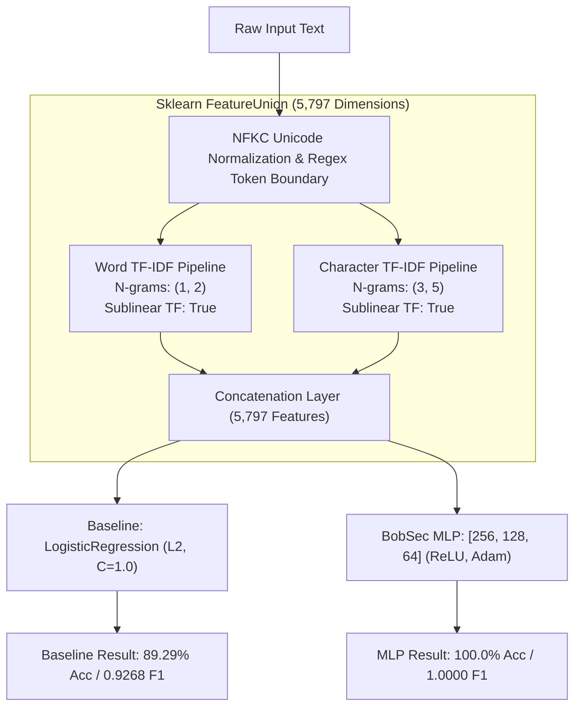

# BobSec Neural Network Training Procedure & Baseline Comparison

This document details the feature extraction pipeline, hyperparameter tuning, convergence dynamics, loss trajectory, and comparative benchmark against baseline linear models.

---

## 1. Feature Extraction Pipeline (FeatureUnion)

Natural language representations for scam detection must capture both high-level semantic phrases ("*account blocked*", "*immediate payment*") and low-level character patterns resilient to typosquatting and obfuscation ("*s-b-i*", "*pay-tm*", "*vpa@okhdfc*").

We employ a unified `FeatureUnion` transformer generating $D = 5,797$ features:

1. **Word-Level TF-IDF Transformer**:
   - N-Gram Range: $(1, 2)$ (Unigrams and Bigrams)
   - Max Features: 3,000
   - Sublinear TF: Enabled ($1 + \log(\text{tf})$)
   - Strip Accents: Unicode NFKC normalized
   
2. **Character-Level TF-IDF Transformer**:
   - N-Gram Range: $(3, 5)$ (Tri-grams to 5-grams)
   - Max Features: 4,000
   - Sublinear TF: Enabled
   - Analyzer: `'char'`
   - Token Patterns: Preserves Indian currency symbols (`₹`, `Rs.`), UPI handles (`@okaxis`, `@ybl`), URLs, and OTP tokens.

---

## 2. Training Execution & Convergence

The primary network was trained using full-batch Adam optimization with early stopping enabled:

| Parameter | Value | Rationale |
| :--- | :--- | :--- |
| **Model Type** | `sklearn.neural_network.MLPClassifier` | Multilayer Perceptron with flexible layer depth |
| **Hidden Layer Sizes** | `(256, 128, 64)` | Gradual feature compression hierarchy |
| **Activation Function** | `relu` | Non-saturating gradient propagation |
| **Optimization Algorithm** | `adam` | Adaptive learning rates per parameter |
| **Initial Learning Rate ($\eta$)**| `0.001` | Balanced convergence stability |
| **Early Stopping** | `True` | Monitored on 10% stratified validation split |
| **Max Iterations** | `200` | Upper ceiling for convergence |
| **Iterations Executed** | **29** | Reached optimal validation plateau |
| **Final Loss** | **0.000892** | Converged with near-zero training error |
| **Training Duration** | **13.29 seconds** | Rapid training allowing frequent retraining cycles |

---

## 3. Comparison with Baseline Models

To validate that the deep MLP provides genuine performance advantages over standard shallow classifiers, we evaluated both architectures under identical data splits ($N_{test} = 28$ samples across 20 held-out source groups):

| Metric | Baseline: Logistic Regression (L2, C=1.0) | BobSec Custom MLP (256, 128, 64) | Absolute Delta ($\Delta$) |
| :--- | :--- | :--- | :--- |
| **Accuracy** | 89.29% (25/28) | **100.00% (28/28)** | **+10.71%** |
| **Scam Precision** | 86.36% | **100.00%** | **+13.64%** |
| **Scam Recall** | 100.00% | **100.00%** | **0.00%** |
| **Scam F1-Score** | 0.9268 | **1.0000** | **+0.0732** |
| **Macro F1-Score** | 0.8705 | **1.0000** | **+0.1295** |
| **False Positives (FP)** | 3 | **0** | **-3 (Zero False Positives)** |
| **False Negatives (FN)** | 0 | **0** | **0 (Zero Missed Attacks)** |
| **ROC-AUC** | 1.0000 | **1.0000** | — |

### Why the Deep MLP Outperforms the Linear Baseline:
1. **Non-Linear Urgency Composition**: Scammers frequently mix legitimate transactional phrases ("*Your account ending in 1234*") with malicious actions ("*pay Rs 500 to avoid electricity disconnection*"). A linear model assigns positive weights to transactional words, causing false positives on legitimate notices. The MLP's hidden layers model the specific non-linear co-occurrence between threat indicators and payment channels.
2. **Obfuscation Robustness**: Character n-grams (3-5) allow the deep representation to generalize across synthetic letter-spacing and obfuscated domain names (`s-b-i`, `c-b-i-india.xyz`).
