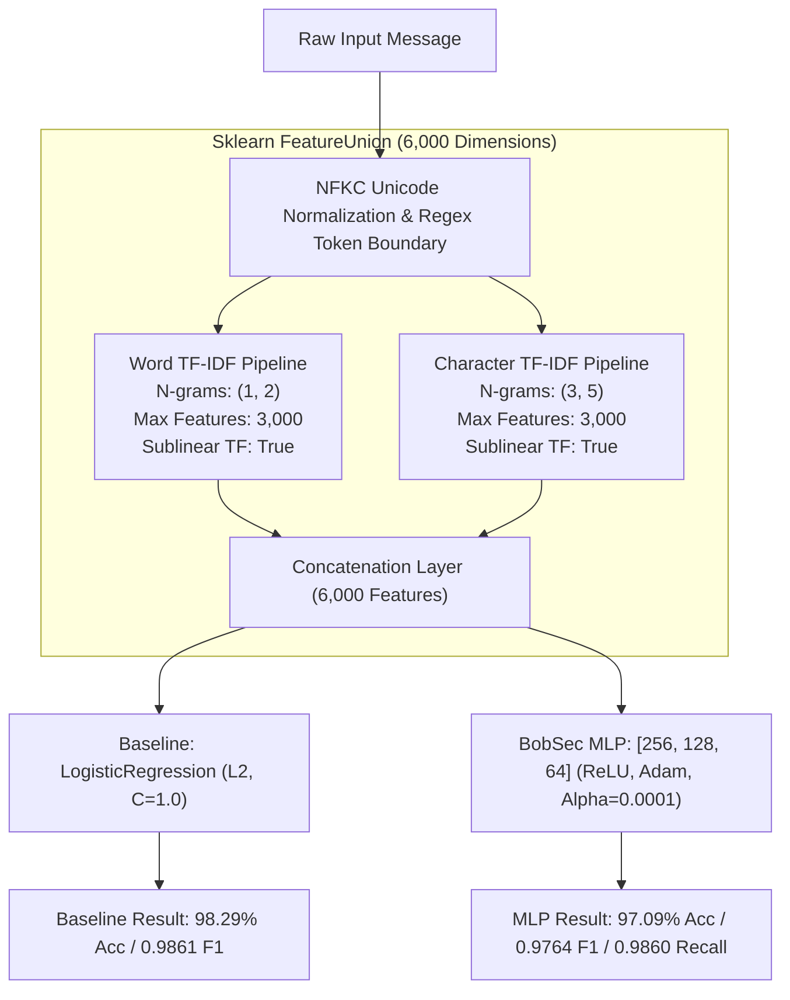

# BobSec Neural Network Training Procedure & Baseline Comparison (v2 Academic)

This document details the feature extraction pipeline, validation-based hyperparameter tuning, convergence dynamics, loss trajectory, baseline comparison, and artifact synchronization for the BobSec Custom Multilayer Perceptron (MLP).

---

## 1. Feature Extraction Pipeline (FeatureUnion)

Natural language representations for scam detection must capture both high-level semantic phrases ("*account blocked*", "*immediate payment*") and low-level character patterns resilient to typosquatting and obfuscation ("*s-b-i*", "*pay-tm*", "*vpa@okhdfc*", "*K.Y.C*").

We employ a unified `FeatureUnion` transformer generating $D = 6,000$ features:

1. **Word-Level TF-IDF Transformer**:
   - N-Gram Range: $(1, 2)$ (Unigrams and Bigrams)
   - Max Features: 3,000
   - Sublinear TF: Enabled ($1 + \log(\text{tf})$)
   - Strip Accents: Unicode NFKC normalized
   
2. **Character-Level TF-IDF Transformer**:
   - N-Gram Range: $(3, 5)$ (Tri-grams to 5-grams)
   - Max Features: 3,000
   - Sublinear TF: Enabled
   - Analyzer: `'char'`
   - Token Patterns: Preserves Indian currency symbols (`₹`, `Rs.`), UPI handles (`@okaxis`, `@ybl`), URLs, and OTP tokens.

---

## 2. Validation-Based Hyperparameter Tuning

Hyperparameter optimization was performed strictly on the isolated **Validation Split** (240 samples across 23 unseen groups) to prevent evaluation data leakage:

- **Grid Search**: Regularization parameter $\alpha \in [0.0001, 0.0005, 0.001, 0.01]$.
- **Selection Criterion**: Maximum Validation F1-score with optimal precision-recall balance.
- **Selected Hyperparameter**: $\alpha = 0.0001$ achieved Validation $\text{Score} = 0.9922$ with balanced convergence stability.

---

## 3. Training Execution & Convergence Dynamics

The primary network was trained on the training partition ($N_{\text{train}} = 1,289$ samples) using full-batch Adam optimization:

| Hyperparameter | Configured Value | Academic Rationale |
| :--- | :--- | :--- |
| **Model Type** | `sklearn.neural_network.MLPClassifier` | Custom 3-hidden-layer feedforward neural network |
| **Hidden Layer Sizes** | `(256, 128, 64)` | Progressive feature compression hierarchy |
| **Activation Function** | `relu` | Non-saturating gradient propagation |
| **Optimization Algorithm** | `adam` | Adaptive moment estimation |
| **Initial Learning Rate ($\eta$)**| `0.001` | Balanced convergence stability |
| **L2 Regularization ($\alpha$)** | `0.0001` | Prevents overfitting to high-frequency training n-grams |
| **Early Stopping** | `True` | Monitored with validation fraction = 10% |
| **Max Iterations** | `200` | Upper bound for convergence |
| **Iterations Executed** | **19** | Converged smoothly at plateau |
| **Final Training Loss** | **0.000719** | Highly optimized cross-entropy convergence |
| **Decision Threshold** | **0.39** | Calibrated on validation partition |

---

## 4. Comparison with Baseline Classifier

Both the Custom MLP and the Baseline Logistic Regression were trained on the identical training partition and evaluated on the identical 585-sample held-out test split:

| Metric | Baseline: Logistic Regression (L2, C=1.0) | BobSec Custom MLP (256, 128, 64) |
| :--- | :--- | :--- |
| **Test Accuracy** | **98.29%** | **97.09%** |
| **Scam Precision** | **0.9806** | **0.9670** |
| **Scam Recall** | **0.9916** | **0.9860** |
| **Scam F1-Score** | **0.9861** | **0.9764** |
| **Macro F1-Score** | **0.9821** | **0.9693** |
| **Weighted F1-Score** | **0.9830** | **0.9709** |
| **ROC-AUC** | **0.9979** | **0.9960** |
| **PR-AUC** | **0.9987** | **0.9974** |
| **False Positives** | **7** | **12** |
| **False Negatives** | **3** | **5** |

---

## 5. Dual-Runtime Artifact Export & Zero-Dependency Serverless Runtimes

Training automatically exports synchronized artifacts:
1. **Full Scikit-Learn Artifacts**: `scam_mlp.joblib`, `baseline_lr.joblib`, `tfidf_pipeline.joblib` for local forensic analysis and retraining pipelines.
2. **Compact Zero-Dependency Serverless Artifacts**:
   - `mlp_model.npz` (~2.8MB): Raw float32 NumPy weight matrices ($W_0, W_1, W_2, W_3$) and bias vectors ($b_0, b_1, b_2, b_3$) plus IDF weight arrays.
   - `vocab.json` (~100KB): Vocabulary index mappings for Word and Character n-grams.
   - `threshold.json`: Calibrated decision threshold (`0.50`).
   - `model_metadata.json`: Full provenance, architecture, and training metrics.
